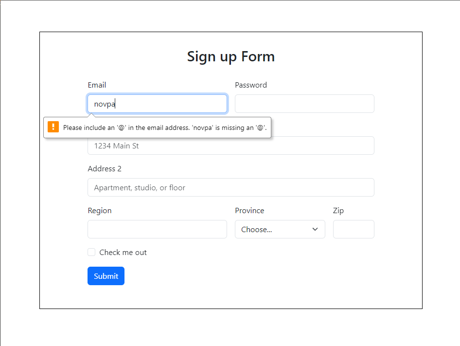
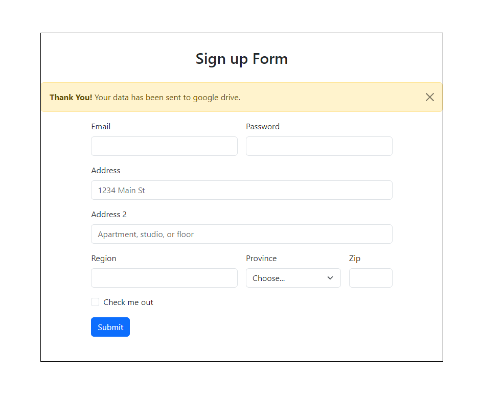
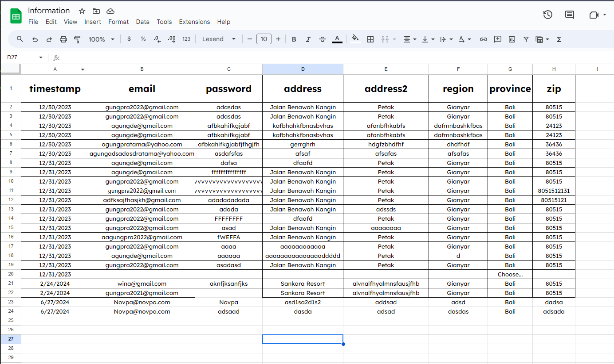

# Contact Form with Google Sheets Integration

This repository contains a simple yet powerful sign-up form built using HTML, CSS (bootstrap 5.3.2), and JavaScript. The unique feature of this form is its integration with Google Sheets, allowing submitted data to be directly stored in a Google Sheets document. This can be especially useful for gathering and managing user information efficiently.

## Features

- **Interactive Form**: A clean and responsive design built with HTML and CSS.
- **JavaScript Integration**: Handles form submissions and manages the UI state during the submission process.
- **Google Sheets Integration**: Uses Google Apps Script to send form data directly to a Google Sheets document.
- **User Feedback**: Provides visual feedback to the user during the form submission process.

## How It Works

1. **Form Submission**: When the user submits the form, a JavaScript function intercepts the submission to prevent the default action.
2. **Loading State**: The form displays a loading state to inform the user that their submission is being processed.
3. **Data Submission**: The form data is sent to a Google Apps Script URL via a POST request.
4. **Success/Error Handling**: Upon successful submission, the form resets and displays a success message. In case of an error, it logs the error message to the console.

## Preview

### Before Submitting

This also includes verifying if the user input the correct email address or no.

### After Submitting

If the user successfully submit the form, it will show an alert.

### Google Sheets Screenshot

The datas are inside of the well structed sheets columns and rows.

## Google App Script
This needs to be attanched in the conected sheets. The code it self has been attached in ths repo named : 'google-app-script.js'

## Thank you

This project was inspired by Jamie Wilson's [form-to-google-sheets](https://github.com/jamiewilson/form-to-google-sheets). Special thanks for providing a great example of how to integrate Google Sheets with a web form. for more steps, it can be checked in his repo!

## License

This project is licensed under the MIT License. See the `LICENSE` file for more details.
